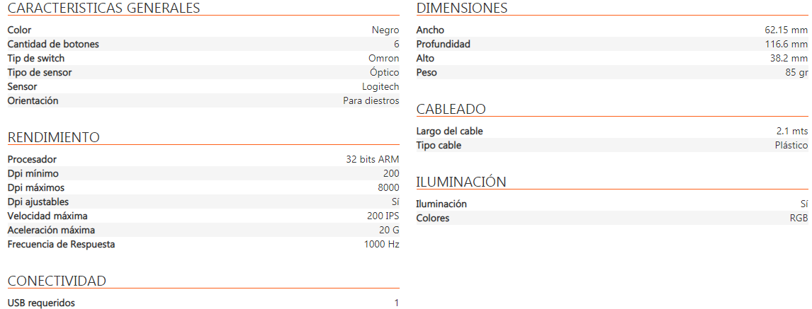
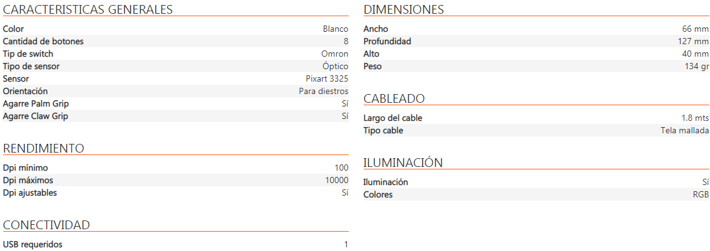
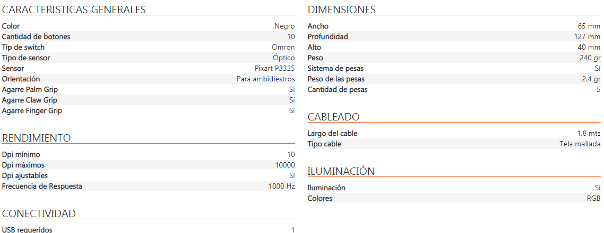
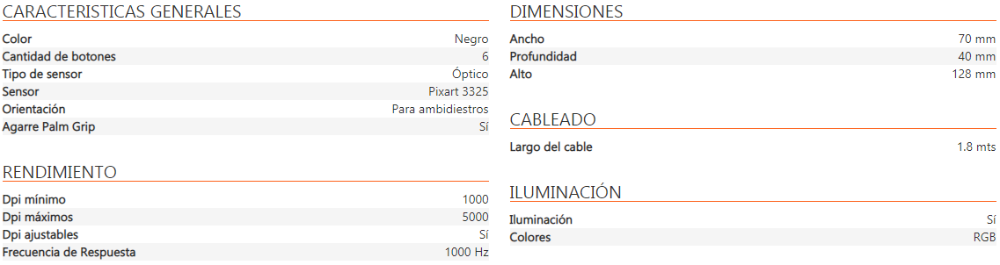

# ***En busqueda de un mouse para gusti***

## Requisitos

* Ergonomico
    * Para mas placer
* Gamer
    * Luces RGB
* 2 botones laterales o mas
    * Velocidad de construccion
* Selector de DPI
    * Ideal para juegos shooter
* Conexion por cable
    * Para reducir los MS

---
## Mouses seleccionados

 * Logitech G203 Lightsync RGB

 [compragamer.com](https://compragamer.com/producto/mouse_logitech_g203_lightsync_rgb_10078?redir=1&nro_max=50 "Logitech G203")

 * Redragon M711-W Cobra White

 [compragamer.com](https://compragamer.com/producto/mouse_redragon_m711_w_cobra_white_10000_dpi_rgb_9845?redir=1&nro_max=50 "Redragon M711")

 * Redragon Phoenix PRO M702-2

 [compragamer.com](https://compragamer.com/producto/mouse_redragon_phoenix_pro_m702_2_7375?redir=1&nro_max=50 "Redragon Phoenix PRO")

  * Marvo Scorpion G943

 [compragamer.com](https://compragamer.com/producto/mouse_marvo_scorpion_g943_5000dpi_rgb_10237?redir=1&nro_max=50 "Marvo Scorpion G943")

 [compragamer.com](https://compragamer.com/ "Pagina Inicio")